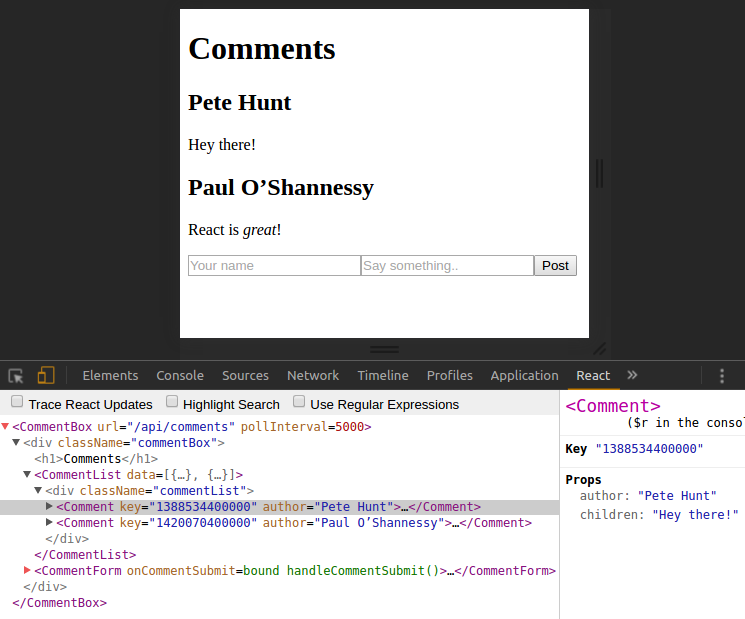

# ReactStart
A useful (work in progress) development environment for ReactJS applications.

## Dependencies

* NodeJS + NPM.
* GruntJS (installed globally).
* Webpack (installed globally).

## Getting Started

Install the dependenices, start the `example/app` and visit `localhost:3000`. It is the same _comments box_ app that you can find in the [official ReactJS tutorial](https://facebook.github.io/react/docs/tutorial.html) with a few modifications.

```sh
$ npm install
$ npm start
```

## Background

The environment is powered by Grunt, Webpack and Babel in conjunction to provide a better development experience. Among other things this toolset take cares of JSX and ES2015 transpilation to ES5 JavaScript.

## Features:

* ES2015 code is transpiled to cross browser ES5.
* JSX syntax is transpiled to cross browser ES5.
* Use CommonJS modules to manage your code as in a NodeJS environment.
* Components will be bundled in a unique file to be served to the browser.
* Optionally, the final bundle can also include the ReactJS source code and any
other third party library.
* Be able to debug in the browser via accurate source-maps viewing your real source code (ES2015 and even JSX syntax) instead of the transpiled version.
* Any change you made in the source code is immediately transpiled and reflected in the result bundle.
* Files are served from the `server/public` folder using an express based server. The resulting `bundle.js`, the `index.html` and any third party libs are alocated here by the Grunt build system (you should not add any file here since the folder is clear every time the build process start).


## Recomended
Install the React Developer Tools for [chrome](https://chrome.google.com/webstore/detail/react-developer-tools/fmkadmapgofadopljbjfkapdkoienihi) or [firefox](https://addons.mozilla.org/en-US/firefox/addon/react-devtools/)! See [how it works](https://github.com/facebook/react-devtools).



## Third party libraries.
In the example app public CDNs are used but you can load libraries from your own server (see: `example/index.html` and check the `server/public/vendor/js/` folder). The source paths of those libraries are configured in `grunt/sources.js` file. The Grunt based build system copy the files on that list to the server public folder (`server/public/vendor/js`).


